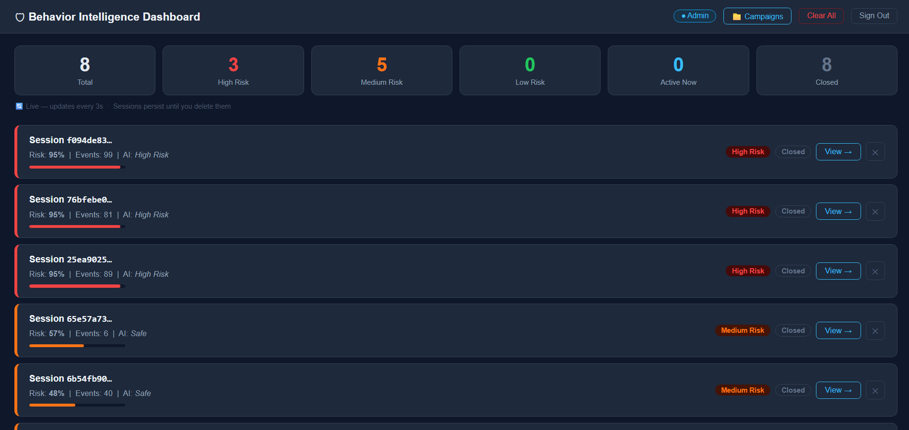
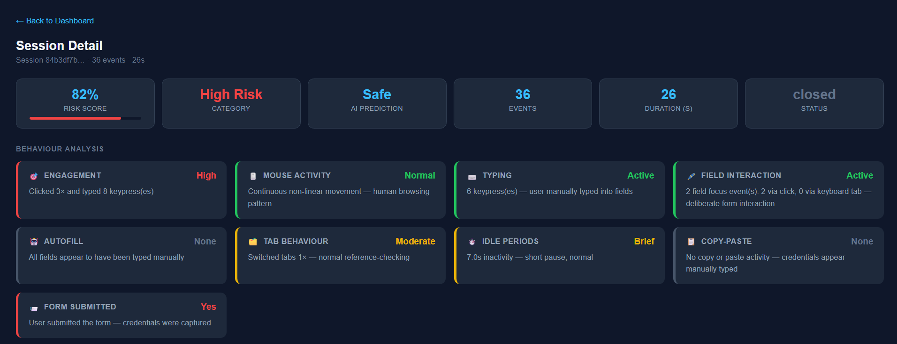
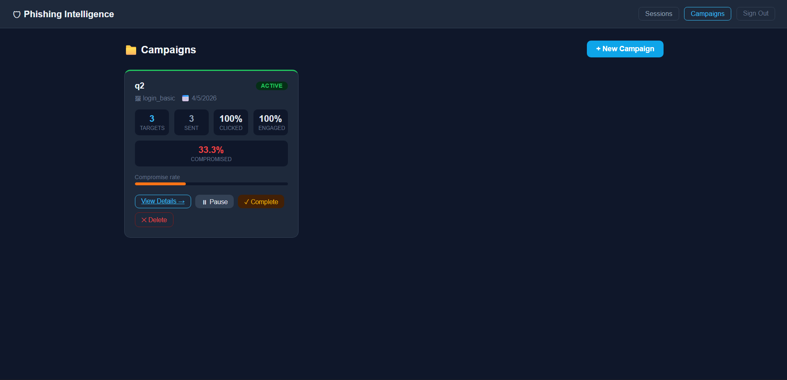
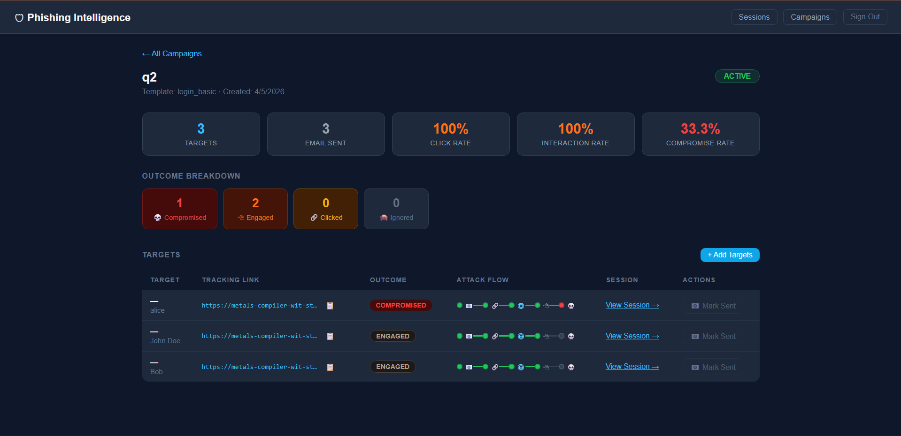
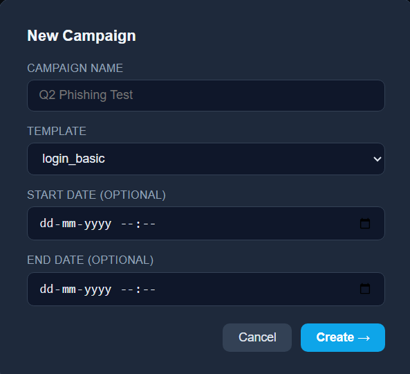

# PhantomX — Phishing Simulation & Awareness Platform

> Built by **Aditya Vishwakarma** · 
> Licensed for non-commercial use only — see [LICENSE](LICENSE)

A self-hosted phishing simulation platform for security awareness training.  
Track behaviour, run campaigns, score risk, and train an ML model — all from a local dashboard served publicly via Cloudflare Tunnel.

> ⚠️ **For authorised security awareness training only.**  
> Never deploy against targets without explicit written written permission.

---

## Screenshots

### Behaviour Intelligence Dashboard

*Live session feed with risk scores, AI predictions, and real-time status.*

### Session Detail — Behaviour Analysis

*Per-session breakdown: 82% risk, 36 events captured, form submitted, status closed.*

### Campaign Management

*Create and track phishing campaigns with click rate, engagement, and compromise metrics.*

### Campaign Detail — Attack Flow Tracking

*Per-target attack flow: Email Sent → Link Clicked → Page Visited → Interaction → Compromised.*

### New Campaign Setup

*Create a campaign, pick a template, and set optional start/end dates.*

---

## Table of Contents

1. [Features](#features)
2. [Project Structure](#project-structure)
3. [Quick Start](#quick-start)
4. [Adding a New Template](#adding-a-new-template)
5. [Running a Campaign](#running-a-campaign)
6. [Training the AI Model](#training-the-ai-model)
7. [Configuration](#configuration)
8. [Architecture Notes](#architecture-notes)
9. [Requirements](#requirements)

---

## Features

- **Multi-template phishing pages** — switch templates per campaign, no code changes needed
- **Campaign management** — create campaigns, add targets, generate unique tracking links per user
- **Attack flow tracking** — Email Sent → Link Clicked → Page Visited → Interaction → Compromised
- **Outcome classification** — Ignored / Clicked / Engaged / Compromised per user
- **Behaviour analysis** — 9-signal dashboard: typing, mouse, idle, copy-paste, autofill, field focus
- **Risk scoring** — heuristic + ML model blend, 0–100 score
- **AI training** — RandomForest trained on your own session data
- **Public URL** — served via Cloudflare Tunnel
- **Persistent sessions** — dashboard data survives page refresh; admin deletes explicitly
- **Separate training store** — `training_data.json` is never cleared by dashboard actions

---

## Project Structure

```
project/
├── simulator.py               # Entry point — start here
├── requirements.txt
├── README.md
├── LICENSE
│
├── server/
│   └── app.py                 # Flask application
│
├── tracker/
│   ├── logger.py              # Session event writer (dual-write)
│   └── campaign_store.py      # Campaign / target / metrics data layer
│
├── analyzer/
│   ├── scorer.py              # Heuristic risk scoring
│   ├── feature_extractor.py   # Named feature dict from events
│   ├── feature_utils.py       # Individual feature functions
│   ├── intent.py              # Intent classification
│   └── anomaly.py             # Z-score anomaly detection
│
├── ai/
│   ├── predictor.py           # Lazy-loaded ML inference
│   ├── train_model.py         # Training pipeline
│   └── model.pkl              # Generated — not in repo
│
├── logs/                      # Generated at runtime — not in repo
│   ├── sessions.json
│   ├── training_data.json
│   ├── campaigns.json
│   ├── baseline.json
│   └── .secret_key
│
└── templates/
    ├── login_basic/
    │   ├── index.html
    │   └── assets/
    │       ├── js/
    │       │   ├── tracker.js
    │       │   └── template.js
    │       ├── css/
    │       ├── fonts/
    │       └── images/
    ├── dashboard.html
    ├── session.html
    ├── campaigns.html
    └── campaign_detail.html
```

---

## Quick Start

### 1. Install dependencies

```bash
pip install -r requirements.txt
```

Install Cloudflare Tunnel CLI:
- **Windows**: download `cloudflared.exe` from https://github.com/cloudflare/cloudflared/releases and add to PATH
- **macOS**: `brew install cloudflare/cloudflare/cloudflared`
- **Linux**: https://developers.cloudflare.com/cloudflare-one/connections/connect-apps/install-and-setup/installation

### 2. Run the simulator

```bash
python simulator.py
```

You will see:

```
Available templates:
  [1] login_basic

Select template number: 1

──────────────────────────────────────────────────────
  🌐 Public URL     : https://random-name.trycloudflare.com
  🔒 Admin login    : http://127.0.0.1:5000/login
  📊 Sessions       : http://127.0.0.1:5000/dashboard
  📁 Campaigns      : http://127.0.0.1:5000/campaigns

  Admin user : admin
  Admin pass : admin1234
──────────────────────────────────────────────────────
```

3. Open the **Admin login** in your browser.
4. Share the **Public URL** (or campaign tracking links) with targets.

---

## Adding a New Template

1. Create a folder under `templates/`:
   ```
   templates/login_microsoft/
   ├── index.html
   └── assets/
       ├── js/
       │   ├── tracker.js    ← copy from login_basic/assets/js/
       │   └── template.js   ← write your own UI logic
       └── css/
   ```

2. In `index.html`, declare these variables before loading scripts:
   ```html
   <script>
     var SESSION_ID  = "%%SESSION_ID%%";
     var CAMPAIGN_ID = "%%CAMPAIGN_ID%%";
     var USER_ID     = "%%USER_ID%%";
   </script>
   <script src="/t/%%TEMPLATE_NAME%%/assets/js/tracker.js"></script>
   <script src="/t/%%TEMPLATE_NAME%%/assets/js/template.js"></script>
   ```

3. In `template.js`, put only your UI logic and call:
   ```js
   window.PhishTracker.sendEvent("form_submit", { field: "email", value: val });
   ```

4. The new template appears automatically in the campaign dropdown.

---

## Running a Campaign

1. Go to `/campaigns` → **+ New Campaign**
2. Pick a template, name your campaign
3. Open the campaign → **+ Add Targets**
4. Paste targets (one per line):
   ```
   alice@company.com, Alice Smith
   bob@company.com, Bob Jones
   ```
5. Copy each unique tracking link and send it in your phishing email
6. Click **📧 Mark Sent** per target after sending
7. Watch the attack flow update live as targets interact

### Attack Flow

```
📧 Email Sent → 🔗 Link Clicked → 🌐 Page Visited → 🖱 Interaction → 💀 Compromised
```

| Outcome | Meaning |
|---------|---------|
| Ignored | Email sent, link never clicked |
| Clicked | Link clicked, page visited |
| Engaged | Interacted with form fields |
| Compromised | Submitted credentials |

---

## Training the AI Model

```bash
python -m ai.train_model
```

This builds `logs/baseline.json`, loads from `logs/training_data.json`, trains a RandomForest, and saves `ai/model.pkl`. Re-run after collecting more sessions.

You need at least 2 sessions with different labels (submitted vs not submitted).

---

## Configuration

| Variable | Default | Description |
|----------|---------|-------------|
| `ADMIN_USER` | `admin` | Dashboard login username |
| `ADMIN_PASS` | `admin1234` | Dashboard login password |
| `PORT` | `5000` | Flask server port |
| `PUBLIC_URL` | auto-set | Cloudflare/ngrok URL |
| `SECRET_KEY` | auto-generated | Flask session key |

```bash
ADMIN_USER=analyst ADMIN_PASS=secure1234 python simulator.py
```

---

## Architecture Notes

- **Placeholder system**: phishing pages use `%%MARKERS%%` not `{{ }}` — no Jinja2 collision
- **Asset routing**: `/t/<template>/assets/<path>` — templates never share assets
- **JS isolation**: each template has its own `tracker.js` + `template.js`, no shared namespace
- **Data stores**: `sessions.json` clears via dashboard; `training_data.json` never auto-clears

---

## Requirements

```
flask>=3.0.0
werkzeug>=3.0.0
scikit-learn>=1.4.0
joblib>=1.3.0
```

`cloudflared` must be on PATH.

---

## License & Author

Built by **Aditya Vishwakarma**  
Contact: aditya.s.vishk@gmail.com

This project is free for personal, educational, and research use.  
**Commercial use requires written permission from the author.**  
See [LICENSE](LICENSE) for full terms.
